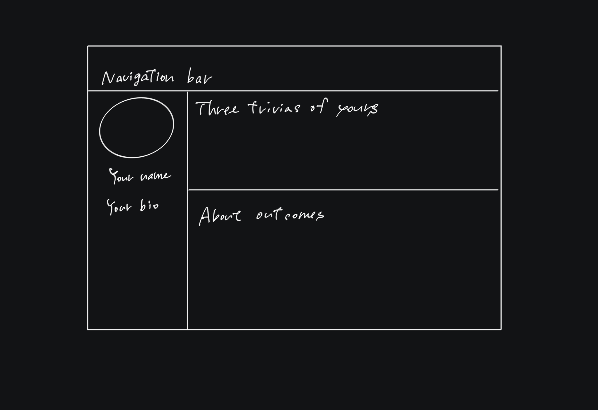

# HTML と CSS に関するアセスメント

自己紹介のページを作成してください。以下を要件とします。

## レイアウト

## 入れてほしい情報

### ご自分について

1. 写真
2. お名前（フルネーム）
3. 自己紹介

### 3つのトリビア

自分を紹介できるエピソードを3つ並べてください。写真とテキストを駆使してください。この箇所のレイアウトは任意ですが、テキストだけではなくきれいなWebサイトにしてください。

### 成果物

以下を含めるようにしてください。この箇所のレイアウトは任意ですが、テキストだけではなくきれいなWebサイトにしてください。

1. 本コースで何を得たいか
2. 現在または将来の業務でそれがどのように役立てられるのか
3. 本コースで得たもので将来どのような人材になりたいか

### ぜひ作成したページを共有してください！

[GitHub Pages](https://docs.github.com/ja/pages/quickstart)を使って、自己紹介ページをWebページとしてホストしてください。

- [自己紹介ページ共有フォーム](https://forms.gle/QJNsPZzn14DSFUS97)
